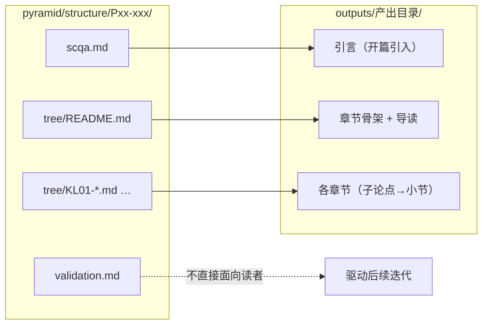

# 产出（Outputs）

基于 [pyramid/structure/](../pyramid/structure/) 视角生成的面向读者的内容。每种产出对应一个已完成拆解的视角。

## 视角 → 产出的转化路径

产出是面向读者的表达，不暴露 atoms、groups、validation 等拆解过程细节。产出的开篇由 SCQA 驱动，章节骨架由 tree 的 Key Line 决定。

→ [产出索引](INDEX.md)（各产出条目总览）

## 产出目录命名规则

- 目录名体现产出形式（如 `methodology/`、`tutorial/`、`blog/`）
- 每个产出目录下包含 README.md（导读 + 标注基于哪个视角）
- 章节文件按 `NN-slug.md` 编号，`00-introduction.md` 为引言

## 新建产出流程

1. 确认对应的 pyramid/structure/ 视角已完成（至少 scqa + tree 初稿）
2. 在 `outputs/` 下创建产出目录
3. 在产出的 README 中标注基于哪个视角
4. 按视角的 tree 结构组织章节，每章开篇结论先行
5. 每篇内容开头标注前置阅读和难度
6. 更新 [INDEX.md](INDEX.md) 的产出总览表

---

## 修订记录

| 日期       | 变更摘要                                                         |
| ---------- | ---------------------------------------------------------------- |
| 2026-02-23 | 重写产出架构：明确视角→产出的转化规则，移除无视角支撑的 tutorial |
| 2026-02-22 | 首次创建                                                         |
