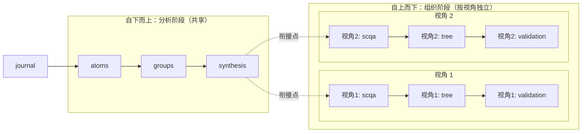
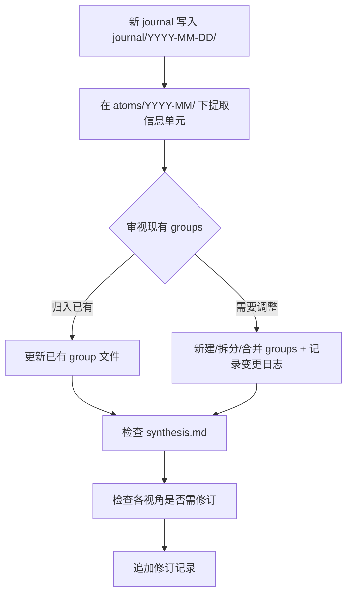

# 金字塔拆解

基于《金字塔原理》对 journal 原始学习日志进行结构化拆解，从零散素材中提炼出系统化的认知地图。

## 方法论

拆解分两个阶段，对应两种思考方式：

- **自下而上（分析阶段）**：从 journal 素材出发，打散为信息单元（atoms），归组提炼观点（groups），收敛为顶层观点候选（synthesis）
- **自上而下（组织阶段）**：从读者视角出发，构造序言（SCQA），展开金字塔全树（tree），验证 MECE 和逻辑链（validation）。不同视角会产生不同的 SCQA 和 tree，共享同一套 analysis 产出。

## 目录导航

### 分析阶段（analysis/）

素材拆解产出，所有视角共享。

| 目录/文件                             | 说明                                                    |
| ------------------------------------- | ------------------------------------------------------- |
| [atoms/](analysis/atoms/)             | 信息单元：从每篇 journal 中提取的独立知识点，按月分目录 |
| [groups/](analysis/groups/)           | 归组：跨文档边界的信息单元分组，每组一个观点句          |
| [synthesis.md](analysis/synthesis.md) | 收敛：从 groups 归纳出的顶层观点候选列表                |

### 组织阶段（structure/）

按视角独立组织，每个视角有自己的一套 SCQA + tree + validation。

| 目录/文件                           | 说明                 |
| ----------------------------------- | -------------------- |
| [structure/](structure/)            | 视角总览 + 变更日志  |
| [\_template/](structure/_template/) | 新建视角的模板文件   |
| PXX-xxx/                            | 各视角目录（待创建） |

→ [视角总览与新建流程](structure/README.md)

## 增量拆解流程

当新的 journal 文档产生后：

1. **提取 atoms** — 在 `analysis/atoms/YYYY-MM/` 下创建对应文件，提取信息单元
2. **归入 groups** — 审视现有分组：新 atoms 归入已有分组？还是需要新建/拆分/合并？
   - 如需调整，在 `analysis/groups/README.md` 变更日志里记录
3. **检查 synthesis** — 顶层观点候选是否需要更新？
4. **检查各视角** — 每个视角的 scqa / tree / validation 是否需要修订？
5. **追加修订记录** — 在受影响的文件底部记录变更

## 扩展性设计

| 产物                | 是否随素材增长               | 组织方式                     |
| ------------------- | ---------------------------- | ---------------------------- |
| atoms               | 是，跟 journal 数量成正比    | 按月分子目录                 |
| groups              | 是，随 atoms 增多而演化      | 目录，带变更日志             |
| synthesis           | 缓慢增长                     | 单文件，带修订记录           |
| 视角（perspective） | 按需新建，不随素材自动增长   | 每个视角一个目录             |
| 视角内 tree         | 是，跟金字塔层数和宽度成正比 | 目录，每个 Key Line 一个文件 |
| 视角内 scqa         | 不会，固定结构               | 单文件                       |
| 视角内 validation   | 缓慢增长                     | 单文件，带修订记录           |

## 当前进度

### 已拆解

（暂无）

### 待拆解

| 月份    | 数量 | journal 文档                                                                                                                                                                                                                                                                                                                                                                                                                        |
| ------- | ---- | ----------------------------------------------------------------------------------------------------------------------------------------------------------------------------------------------------------------------------------------------------------------------------------------------------------------------------------------------------------------------------------------------------------------------------------- |
| 2026-01 | 6    | openclaw-analysis-report, fork-management-guide, channel-deployment-guide, model-agent-config-guide, openclaw-doctor-guide, tinycore-feasibility-report                                                                                                                                                                                                                                                                             |
| 2026-02 | 15   | custom-channel-guide, extension-development-guide, skills-guide, cron-config-guide, agent-evolution-guide, external-scripting-guide, cursor-terminal-config-guide, wecom-plugin-deployment-guide, browser-relay-guide, openclaw-core-concepts-pyramid, openclaw-core-concepts-qa-and-usage, independent-agent-creation-guide, agent-token-usage-monitoring-analysis, merge-main-upgrade-summary, knowledge-base-architecture-design |
