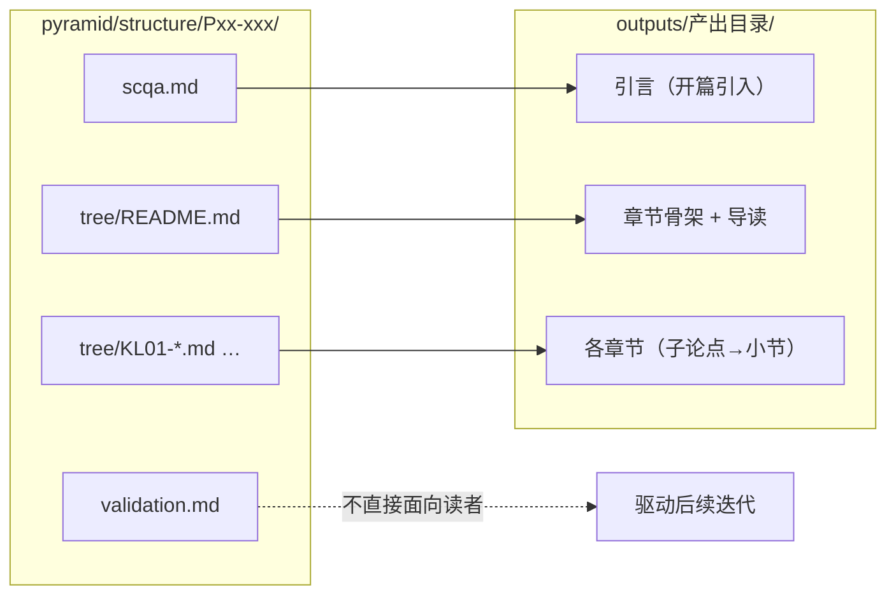

# 产出（Outputs）

基于 [pyramid/structure/](../pyramid/structure/) 视角生成的面向读者的内容。每种产出对应一个已完成拆解的视角。

## 视角 → 产出的转化路径

产出是面向读者的表达，不暴露 atoms、groups、validation 等拆解过程细节。产出的开篇由 SCQA 驱动，章节骨架由 tree 的 Key Line 决定。

→ [产出索引](INDEX.md)（各产出条目总览）

## 产出目录命名规则

- 目录名体现产出形式（如 `methodology/`、`tutorial/`、`blog/`）
- 每个产出目录下包含 README.md（导读 + 标注基于哪个视角）
- 章节文件按 `NN-slug.md` 编号，`00-introduction.md` 为引言

## 系列规约文档（`_convention.md`）

产出系列目录下可放置 `_convention.md` 作为该系列的强制上下文规约。AI 生成新篇目时**必须**将此文件纳入上下文。

| 项目     | 说明                                              |
| -------- | ------------------------------------------------- |
| 文件位置 | `outputs/<系列目录>/_convention.md`               |
| 命名约定 | 以 `_` 开头，表示元文件而非读者内容               |
| 作用范围 | 该系列下所有篇目的生成、审校、续写                |
| 维护时机 | 每完成一篇新文章后，在 §5（前文提要）追加该篇摘要 |

规约文档的标准章节：

| 章节                | 内容                                             |
| ------------------- | ------------------------------------------------ |
| §1 系列身份         | 系列名、视角 ID、发布渠道、目标读者、人称、语言  |
| §2 作者事实         | 笔名、GitHub、部署方式、时间线等不可更改的事实   |
| §3 核心实体定义     | 所有专有名词、角色、工具的名称与定义对照表       |
| §4 已确立的关键数据 | 已在发布篇目中引用过的数字，后续篇目必须保持一致 |
| §5 前文提要         | 按篇序列出每篇核心内容摘要，确保叙事连贯         |
| §6 系列惯例         | 篇头篇尾格式、比喻体系、图片占位、衔接方式等     |
| §7 硬性禁止         | 不可违反的红线（禁止编造数据、矛盾已发布内容等） |

现有规约文档：

- [`yangxia-series/_convention.md`](yangxia-series/_convention.md) — JS 的养虾日记系列

## 新建产出流程

1. 确认对应的 pyramid/structure/ 视角已完成（至少 scqa + tree 初稿）
2. 在 `outputs/` 下创建产出目录
3. 在产出的 README 中标注基于哪个视角
4. 若为多篇系列，创建 `_convention.md` 规约文档（参考上方标准章节）
5. 按视角的 tree 结构组织章节，每章开篇结论先行
6. 每篇内容开头标注前置阅读和难度
7. 更新 [INDEX.md](INDEX.md) 的产出总览表
8. 每完成一篇，更新 `_convention.md` 的 §5 前文提要

---

## 修订记录

| 日期       | 变更摘要                                                         |
| ---------- | ---------------------------------------------------------------- |
| 2026-02-23 | 重写产出架构：明确视角→产出的转化规则，移除无视角支撑的 tutorial |
| 2026-02-22 | 首次创建                                                         |
